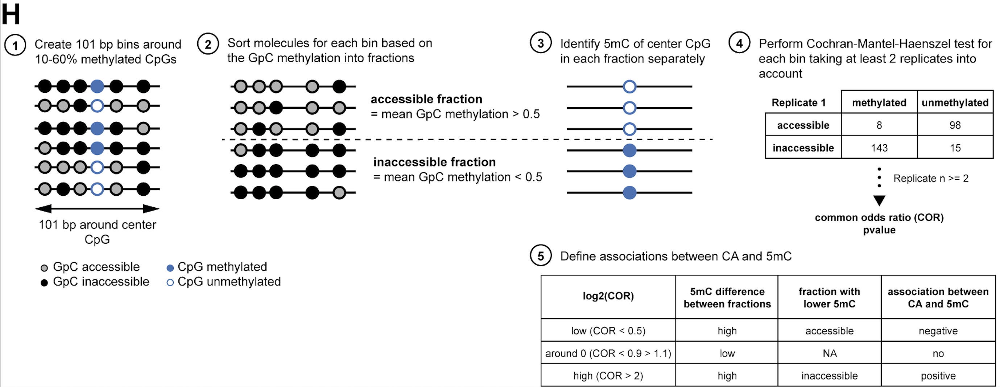

# Kreibich et al., 2023 - The regulation of enhancers by DNA methylation

# Introduction
This GitHub repository contains all primary code to reproduce the main analyses for the publication "Single molecule footprinting identifies context-dependent regulation of enhancers by DNA methylation" [Kreibich et al., 2022, bioRxiv](https://doi.org/10.1101/2022.05.19.492653), from the [Krebs laboratory](https://www.embl.de/research/units/genome_biology/krebs/index.html).

In this publication, we use Single Molecule Footprinting (SMF) to measure chromatin accessibility (CA), transcription factor (TF) binding and endogenous DNA methylation (5mC) simultaneously at the same single DNA molecules. This enables us to analyze the molecular relationship between these gene regulatory features.  
SMF is a high-throughput sequencing technology developed in the [Krebs laboratory](https://www.embl.de/research/units/genome_biology/krebs/index.html). It consists of marking accessible genomic cytosines in the GpC context using a exogenous methytransferase and subsequent bisulfite sequencing (BS). Consequently, GpCs protected by the binding of DNA-interacting proteins (e.g. TFs, nucleosomes, GTFs, etc.) will remain unmethylated, while the accessible cytosines will be methylated.
In this project, we read out the cytosine methylation in CpG and GpC context independently for each DNA molecule at genomic bins of interest (101 bp bins or around TF binding sites (TFBS)). Those methylation scores are then used to determine the association between DNA methylation (CpG context) and chromatin accessibility or TF binding (GpC context) using a statistical test (Cochran-Mantel-Haenszel test).  


# SMF Analyses strategies
To exclude ambigious cytosine methylation calls (e.g. GCGs), we use more stringent cytosine contexts:  
NWCGW - for CpGs   
DGCHN - for GpCs

In general, the SMF analysis is performed with two strategies: (1) Chromatin accessibility view and (2) TFBS view.

**(1) Chromatin accessibility (CA) analysis**
* This analysis is based on the assumption that the binding of a TF to the DNA opens up a wider region that is marked as accessible.
* Here, we use a 101 bp bin surrounding 10-60% methylated CpG to calculate the local chromatin accessibility using the mean of the GpC methylation calls.
* We then perform a Cochran-Mantel-Haenszel test to associate the CpG methylation of the center CpG with the accessible or inaccessible fraction.

A more detailed schematic view of this analysis can be found in Figure S1H of the manuscript and is also shown here:  


**(2) Transcription factor binding site (TFBS) analysis**
* Here, we center a 30 bp center bin at TFBS that contains at least one CpG. In addition 2 neighboring X bp bins up- and downstream are created. The GpC methylation within tose three bins is used to determine the binding state of the TFBS (TF bound, accessible, nucleosome bound).
* We then perform a Cochran-Mantel-Haenszel test to associate the CpG methylation of the center bin CpG with the TF bound or nucleosome bound fraction.
* For TFBS the JASPAR 2018 database is used and curated using ChIP-seq data.
* For more information on SMF analysis of TFBS, see [Kleinendorst and Barzaghi et al., 2022]() and [Soenmezer et al., 2022]().

# Information on scripts and data provided

## Folder structure

Kreibich_2023_5mC_at_enhancers
|
|__scripts
    |
    |__utilities
|
|__data
|
|__data_results (created)
    |
    |__single_molecule_call (created)
    |
    |__plots (created)  


## Order of scripts
### CA analysis
#### Wild type ES data

1. [Single_molecule_methylation_call_CG_GC_WG_MM_CGcentered_EK2022.r](scripts/Single_molecule_methylation_call_CG_GC_WG_MM_CGcentered_EK2022.r)  
    * Use [run_single_molecule_meth_call.sh](scripts/run_single_molecule_meth_call.sh) to run on cluster  
    * Performes single molecule methylation calling for all CpGs (NWCGWs) and GpCs (DGCHNs) in genomic bins of interest.  

2. [Single_molecule_methylation_analysis_CG_GC_WG_MM_CGcentered_EK2022.r](scripts/Single_molecule_methylation_analysis_CG_GC_WG_MM_CGcentered_EK2022.r)  
    * Use [run_single_molecule_meth_analysis.sh](scripts/run_single_molecule_meth_analysis.sh) to run on cluster  
    * Uses previous single molecule methylation calling to get a coverage + methylation table and to compute the Cochran-Mantel-Haenszel test.  
    * For the statistical test, you need at least 2 replicates.  

3. [Make_cytosine_context_GRanges.r](scripts/Make_cytosine_context_GRanges.r)  
    * Creates GRange object with cytosine annotation.  

4. [Make_chromHMM_annotations_bins_tibble.r](scripts/Make_chromHMM_annotations_bins_tibble.r)  
    * Annotates bins with chromHMM annotation and creates chromHMM clusters.  

5. [Make_Final_CG_CMH_data_tibbles_cell_line.Rmd](scripts/Make_Final_CG_CMH_data_tibbles_cell_line.Rmd)  
    * Creates final output tibbles of CA analysis including coverages, mean methylations, Conchran-Mantel-Haenszel test results, ICR annotation, chromHMM annotation, final category definition (5mC-CA-association)  

6. [Analysis_CA_CMH_cell_line.Rmd](scripts/Analysis_CA_CMH_cell_line.Rmd)  
    * Performes analysis of 5mC-CA-association data in an RMarkdown notebook and saves the important plots.  

7. [Analysis_DHS_peak_summit.Rmd](scripts/Analysis_DHS_peak_summit.Rmd)  
    * Performes DHS peak analysis for ES data in an RMarkdown notebook and saves the important plots.  

8. [Plot_GenomeBrowserView.R](scripts/Plot_GenomeBrowserView.R)  
    * Plot GenomeBrowserView of data of interest for region of interest.  

9. [Plot_SMF_single_loci_CA_ES_plus_TKOs.r](scripts/Plot_SMF_single_loci_CA_ES_plus_TKOs.r)  
    * Plot single locus example of SMF data without TKOs.  
    * Functions are based on the R package [SingleMoleculeFootprinting](https://bioconductor.org/packages/release/bioc/html/SingleMoleculeFootprinting.html). Find more information about SMF plotting there.  
     

\

#### F1 data

1. [Single_molecule_methylation_call_CG_GC_WG_MM_CGcentered_EK2022.r](scripts/Single_molecule_methylation_call_CG_GC_WG_MM_CGcentered_EK2022.r)  
    * Use [run_single_molecule_meth_call.sh](scripts/run_single_molecule_meth_call.sh) to run on cluster  
    * Performes single molecule methylation calling for all CpGs (NWCGWs) and GpCs (DGCHNs) in genomic bins of interest.  
    * Run for each allele individually.   

2. [Single_molecule_methylation_analysis_CG_GC_WG_MM_CGcentered_EK2022.r](scripts/Single_molecule_methylation_analysis_CG_GC_WG_MM_CGcentered_EK2022.r)  
    * Use [run_single_molecule_meth_analysis.sh](scripts/run_single_molecule_meth_analysis.sh) to run on cluster.  
    * Uses previous single molecule methylation calling to get a coverage + methylation table.  
    * Not necessary to compute CMH test!  
    * Run for each allele individually.  

3. [Make_Final_CG_CMH_data_tibbles_cell_line.Rmd](scripts/Make_Final_CG_CMH_data_tibbles_cell_line.Rmd)  
    * Creates final output tibbles of CA analysis including coverages, mean methylations, ICR annotation, chromHMM annotation.  
    * Exclude CMH annotation, state annotation.  

4. [Analysis_CA_CMH_F1_ICRs.Rmd](scripts/Analysis_CA_CMH_F1_ICRs.Rmd)  
    * Performes comparative analysis between ICRs and non-ICR negative 5mC-CA-association sites.   

\

#### 5mC perturbation assay
In addition to the WT ES analysis (1.-5.) run the following scripts: 

1. [Single_molecule_methylation_call_CG_GC_WG_MM_CGcentered_EK2022.r](scripts/Single_molecule_methylation_call_CG_GC_WG_MM_CGcentered_EK2022.r)  
    * Run again on TKO data.  

2. [Single_molecule_methylation_analysis_CG_GC_WG_MM_CGcentered_EK2022.r](scripts/Single_molecule_methylation_analysis_CG_GC_WG_MM_CGcentered_EK2022.r)  
    * Run again on TKO data, but without the CMH test.   

3. [Make_Final_CG_CMH_data_tibbles_TKOs.Rmd](scripts/Make_Final_CG_CMH_data_tibbles_TKOs.Rmd)  
    * Creates final output tibbles for TKO data (for which no statistical is applied) by calculating coverage and methylation states for CpGs and GpCs in bins.  

4. [Make_Final_CG_CMH_data_tibbles_ES_plus_TKOs.Rmd](scripts/Make_Final_CG_CMH_data_tibbles_ES_plus_TKOs.Rmd)  
    * Combines WT and TKO tibbles into one and calculates differences in accessibility and methylation.  

5. [Analysis_CA_CMH_ES_TKOs.Rmd](scripts/Analysis_CA_CMH_ES_TKOs.Rmd)  
    * Performes analysis of 5mC perturbation assays in an RMarkdown notebook and saves the important plots.  

6. [Plot_SMF_single_loci_CA_ES_plus_TKOs.r](scripts/Plot_SMF_single_loci_CA_ES_plus_TKOs.r)  
    * Plot single locus example of SMF data with TKOs.  
    * Functions are based on the R package [SingleMoleculeFootprinting](https://bioconductor.org/packages/release/bioc/html/SingleMoleculeFootprinting.html). Find more information about SMF plotting there.  
     

\

#### Somatic cell lines
Run first scripts as described for WT ES data:

1. [Single_molecule_methylation_call_CG_GC_WG_MM_CGcentered_EK2022.r](scripts/Single_molecule_methylation_call_CG_GC_WG_MM_CGcentered_EK2022.r)  

2. [Single_molecule_methylation_analysis_CG_GC_WG_MM_CGcentered_EK2022.r](scripts/Single_molecule_methylation_analysis_CG_GC_WG_MM_CGcentered_EK2022.r)   

3. [Make_Final_CG_CMH_data_tibbles_cell_line.Rmd](scripts/Make_Final_CG_CMH_data_tibbles_cell_line.Rmd)  
    * Creates final output tibbles of CA analysis including coverages, mean methylations, Conchran-Mantel-Haenszel test results, ICR annotation, chromHMM annotation, final category definition (5mC-CA-association).  
    * Run this also for somatic cell lines.  

4. [Analysis_CA_CMH_cell_line.Rmd](scripts/Analysis_CA_CMH_cell_line.Rmd)
    * Performes analysis of 5mC-CA-association data in an RMarkdown notebook and saves the important plots.  
    * You can run this also for somatic cell lines to get e.g. the volcano plot of the 5mC-CA-association. But be aware, that the ICRs and chromHMM annotations are **ES-specifc** and therefore NOT suitable for annotating the somatic cell lines.  

5. [Analysis_CA_CMH_cell_lines_comparison.Rmd](scripts/Analysis_CA_CMH_cell_lines_comparison.Rmd)  
    * Compares ES to Neuronal progenitors (NPs).  
    * Produces heatmap of negative 5mC-CA-association sites of all cell lines.  
    * Prdocues GO term analysis plots.  

6. [Plot_SMF_single_loci_CA_ES_plus_somatic_cell_lines.r.r](scripts/Plot_SMF_single_loci_CA_ES_plus_somatic_cell_lines.r.r)  
    * Plot single locus example of SMF data with other cell lines.  
    * Functions are based on the R package [SingleMoleculeFootprinting](https://bioconductor.org/packages/release/bioc/html/SingleMoleculeFootprinting.html). Find more information about SMF plotting there.  
       

\

### TFBS analysis  
1. [Single_molecule_methylation_call_CG_GC_WG_MM_TFcentered_EK2022.r](scripts/Single_molecule_methylation_call_CG_GC_WG_MM_TFcentered_EK2022.r)  
    * Using [run_single_molecule_meth_call.sh](scripts/run_single_molecule_meth_call.sh) to run on cluster.  

2. [Single_molecule_methylation_analysis_CG_GC_WG_MM_TFcentered_EK2022.r](scripts/Single_molecule_methylation_analysis_CG_GC_WG_MM_TFcentered_EK2022.r)  
    * Using [run_single_molecule_meth_analysis.sh](scripts/run_single_molecule_meth_analysis.sh) to run on cluster.  

3. [Make_Final_TF_CMH_data_tibbles_ES_TKO_TET.Rmd](scripts/Make_Final_TF_CMH_data_tibbles_ES_TKO_TET.Rmd)  
    * Creates final output tibbles of TF analysis including coverages, mean methylations, Conchran-Mantel-Haenszel test results, chromHMM annotation, final category definition (5mC-TF-association)  
    * Adds data of perturbation experiments (DNMT/ TET TKOs).  

    [OPTIONAL] If you only want to look at WT data, you can use the following scripts:  

    * For WT ES cells: [Make_Final_TF_CMH_data_tibbles_ES_only.Rmd](scripts/Make_Final_TF_CMH_data_tibbles_ES_only.Rmd)  
    * For WT somatic cells: [Make_Final_TF_CMH_data_tibbles_somatic_cell_line.Rmd](scripts/Make_Final_TF_CMH_data_tibbles_somatic_cell_line.Rmd)  


4. [Analysis_TFBS_CMH_ES_5mCvsBinding.Rmd](scripts/Analysis_TFBS_CMH_ES_5mCvsBinding.Rmd)  
    * Performes analysis of WT 5mC-TF-association, methylation and state distribution for TFs of interest in an RMarkdown notebook and saves the important plots.  

5. [Analysis_TFBS_CMH_ES_5mCvsBinding.Rmd](scripts/Analysis_TFBS_CMH_ES_5mCvsBinding.Rmd)  
    * Performes analysis of WT 5mC-TF-association and of the 5mC perturbation assays in an RMarkdown notebook and saves the important plots.  

6. [Plot_SMF_single_loci_TF_ES_plus_TKOs.r](scripts/Plot_SMF_single_loci_TF_ES_plus_TKOs.r)  
    * Plot single locus example of SMF data with TKOs. 
    * Functions are based on the R package [SingleMoleculeFootprinting](https://bioconductor.org/packages/release/bioc/html/SingleMoleculeFootprinting.html). Find more information about SMF plotting there.  


\

## R packages needed (not all needed for all scripts):

* BSgenome.Mmusculus.UCSC.mm10  
* ComplexHeatmap  
* circlize  
* DescTools  
* EnrichedHeatmap  
* genomation  
* GenomicRanges  
* ggbeeswarm  
* ggbio  
* ggpubr  
* ggrepel  
* Mus.musculus  
* parallel  
* patchwork  
* plyranges  
* QuasR  
* RColorBrewer  
* rGREAT  
* rtracklayer  
* samplesizeCMH  
* scales  
* SingleMoleculeFootprinting  
* tidyverse  

## Input files needed
**Provided in [data/](data/):**  

* 'mESC_E14_12_dense.annotated.bed'  
* 'GRange_mapped_jaspar2018_ChIP_score10_inBaits_BANP.rds'  
* 'mapped_jaspar2018_ChIP_score10_inBaits_BANP_all_locus_NONunique.rds'  

**Created with given scripts:**  

* 'CGs_over_baits_101bp.rds' --> [Single_molecule_methylation_call_CG_GC_WG_MM_CGcentered_EK2022.r](scripts/Single_molecule_methylation_call_CG_GC_WG_MM_CGcentered_EK2022.r)  
* 'CGs_over_baits_101bp_NWCGW.rds' --> [Make_cytosine_context_GRanges.r](scripts/Make_cytosine_context_GRanges.r)  

* 'chromHMM_30bp_TFBS_with_clusters.rds' --> [Make_chromHMM_annotations_TFBS_tibble.r](scripts/Make_chromHMM_annotations_TFBS_tibble.r)  
* 'chromHMM_annotations_bins.rds' --> [Make_chromHMM_annotations_bins_tibble.r](scripts/Make_chromHMM_annotations_bins_tibble.r)  

\

## Preparatory work
Before starting running the script, you have to do the following:  

- Align the SMF data using QuasR (see below)  
- Perform QCs  
- Deduplicate (if genome-wide SMF data)  
- Make a QuasR input file for the aligned data (see [example file](data/example/QuasR_aligned_files_ES_NO_R1_R2_R5a6_rmdup.txt)  
- Install R packages  
- unzip zipped files in data directory  

\

## Preamble: preprocessing SMF data
To ensure compatibility with our downstream tools, we recommend aligning sequencing reads using the QuasR function [qAlign](https://www.rdocumentation.org/packages/QuasR/versions/1.12.0/topics/qAlign) as follows
```r
cl = makeCluster(40)
prj = QuasR::qAlign(sampleFile = sampleFile,
              genome = genome,
              aligner = "Rbowtie",
              projectName = "prj", 
              paired = "fr",
              bisulfite = "undir", 
              alignmentParameter = "-e 70 -X 1000 -k 2 --best -strata",
              alignmentsDir = "./", 
              cacheDir = tempdir(),
              clObj = cl)
```
For more details on how to structure the **sampleFile** argument we refer to the [qAlign](https://www.rdocumentation.org/packages/QuasR/versions/1.12.0/topics/qAlign) documentation.
For more details on SMF data preprocessing we refer to the computational steps of our SMF methods manuscript [Kleinendorst and Barzaghi et al., 2022](https://doi.org/10.1038/s41596-021-00630-1).

\

# Descriptions of the analyses
More detailed descriptions of the individual analyses can be found in the STAR methods section of the publication [Kreibich et al., 2022, bioRxiv](https://doi.org/10.1101/2022.05.19.492653).
